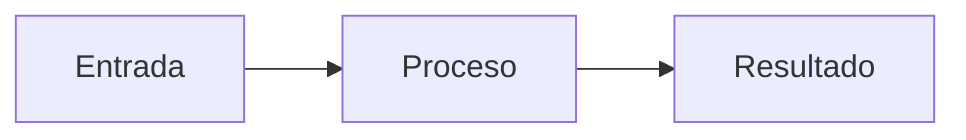

# SDD: [Nombre del cambio]

> **Estado:** `borrador` | `aprobado` | `implementando` | `completado` | `deprecado`
> **Autor:** [Nombre]
> **Fecha:** YYYY-MM-DD
> **Última actualización:** YYYY-MM-DD

> Esta plantilla documenta una decisión o un cambio relevante. No tienes que completar todas las secciones: elimina las que no correspondan y no documentes detalles que aún no estén decididos.

---

## 1. Contexto

¿Qué problema hay? ¿A quién afecta? ¿Por qué conviene resolverlo ahora?

[Describe el problema concreto, no solo la solución que imaginas.]

### Restricciones

[Opcional. Limitaciones técnicas, dependencias externas, compatibilidad o decisiones que no puedan cambiarse.]

---

## 2. Objetivos y límites

### Objetivos

- [Qué debe lograr este cambio]
- [Qué otro resultado importa]

### No incluye

- [Qué queda explícitamente fuera del alcance]
- [Qué podría hacerse en otro cambio]

---

## 3. Decisiones

[Registra solo las decisiones importantes. Explica brevemente el motivo y el coste asumido de cada una.]

### [Decisión]

- **Elegida:** [Qué se hará]
- **Motivo:** [Por qué esta opción]
- **Alternativas descartadas:** [Si son relevantes]
- **Revisar si:** [Qué tendría que cambiar para reconsiderarla]

---

## 4. Diseño y flujo

[Explica cómo funcionará la solución con el detalle necesario para implementarla y revisarla. Incluye los componentes, el flujo principal y los estados si son importantes.]



[Elimina el diagrama si no aporta información útil.]

---

## 5. Contratos y datos

[Opcional. Incluye solo los contratos que cambien o que hagan falta para implementar el cambio.]

### Interfaces o tipos

```ts
// Tipos relevantes
```

### Endpoints o comandos

| Método/comando | Ruta o nombre | Propósito |
|---|---|---|
| [GET/POST/comando] | [ruta] | [qué hace] |

### Persistencia

[Tablas, migraciones, relaciones, índices o políticas que se vean afectadas.]

---

## 6. Comportamiento esperado

### Caso principal

1. [Paso]
2. [Paso]
3. [Resultado esperado]

### Casos importantes

| Escenario | Comportamiento esperado |
|---|---|
| [Caso normal o de error] | [Resultado] |
| [Edge case relevante] | [Resultado] |

### Criterios de aceptación

- [ ] [Condición verificable para considerar terminado el cambio]
- [ ] [Otra condición verificable]

---

## 7. Testing

[Indica qué se probará y qué quedará fuera. No es necesario listar cada test individual.]

- [ ] Caso principal
- [ ] Casos de error relevantes
- [ ] Validaciones y contratos
- [ ] Integración con dependencias externas, usando mocks si corresponde

**Fuera de alcance por ahora:** [Opcional. Qué no se probará y por qué.]

---

## 8. Preguntas, riesgos y pendientes

[Opcional. Si no hay nada pendiente, elimina esta sección.]

- [ ] [Pregunta aún no resuelta]
- [ ] [Riesgo y su mitigación]
- [ ] [Trabajo pendiente para otro cambio]

---

## 9. Referencias

[Opcional. Enlaces a código, documentación, issues, migraciones o decisiones relacionadas.]

- [Nombre]: `[ruta o enlace]`

---

## 10. Changelog

[Opcional. Úsalo si el SDD cambia durante la implementación. No borres las entradas anteriores.]

| Fecha | Cambio | Motivo |
|---|---|---|
| YYYY-MM-DD | Versión inicial | - |

---
